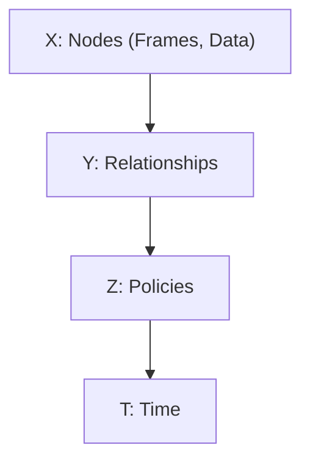
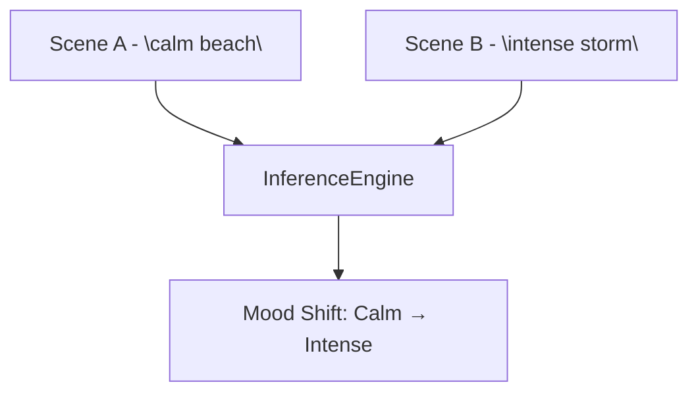
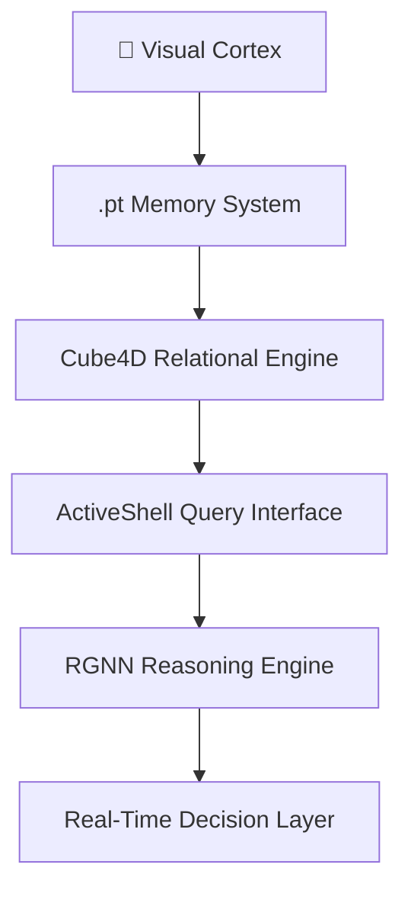
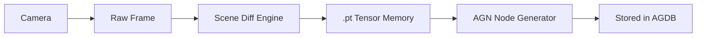
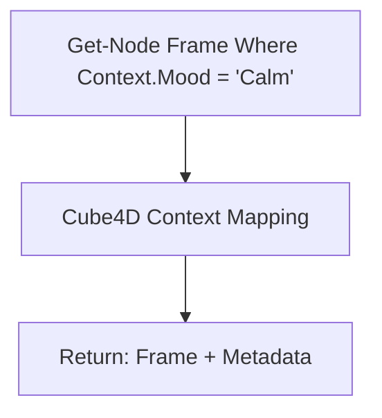
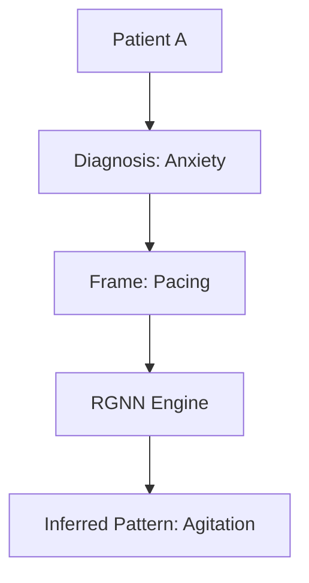
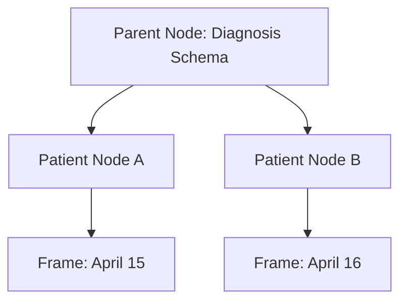
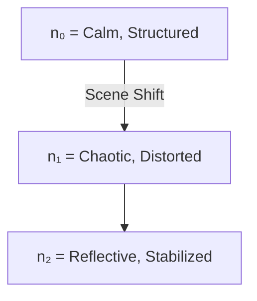
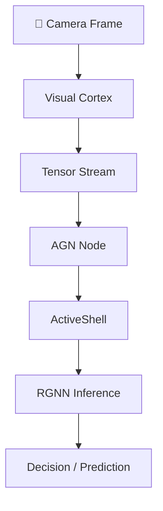

# Active Graph Networks (AGNs): Data That Remembers


> 🔁 **“X (structure), Y (purpose), Z (meaning) define n (identity) across T (time).”**
> The foundation of AGNs: what something is, why it matters, and how it behaves — held in memory through time.

> **AGNs – The Answer**
> *Where memory isn’t a record — it’s the structure of meaning.*

---

## Executive Summary

**Active Graph Networks (AGNs)** redefine artificial intelligence by giving data a sense of identity across time. Built on the **Cube4D** model, AGNs structure **relationships, identity, and time** into a dynamic field — not a database, but a **system that thinks with memory**.

From real-time video analytics to cross-domain reasoning, AGNs power applications in healthcare, finance, and beyond, with a scalable stack integrating PyTorch, FastAPI, and React.

### What’s Inside:

- 🎥 **Temporal Memory Recorder**: .pt frame capture for video and time-series data
- 🧠 **Relational Engine**: Cube4D + dynamic reasoning
- 📡 **ActiveShell**: Queryable interface for real-time insights
- 🧬 **RGNN Integration**: Hierarchical reasoning across domains
- ☁️ **Infra-Ready**: Azure, FastAPI, React for enterprise deployment

---

## Introduction: Solving the Memory Problem

Today’s AI systems excel at static patterns but falter when context shifts. They don’t remember — they retrain. **Active Graph Networks** solve this by assigning relational meaning to every data point: what it is, why it matters, and how it evolves over time.

Powered by the **Cube4D** model, AGNs create a structured framework for temporal cognition, enabling systems to reason, adapt, and query without endless retraining.

### Why AGNs Matter

- 🕰️ **Real-Time Cognition**: Structured memory for dynamic environments
- 🔍 **Queryable State**: Access insights without recomputation
- 🌐 **Cross-Domain Power**: From video to markets, AGNs scale across use cases

> “This system is how we make data remember. Not with weight updates — but with structure, identity, and context held across time.” — *Callum Maystone*

---

## The Visual Cortex: Frame-by-Frame Identity

AGNs don’t store frames — they store **tension points in time**. Each `.pt` file becomes a **memory node** with relational anchors, not just pixels.

### How It Works

- 📸 **Frame Capture**: .pt tensors store raw data + metadata (e.g., location, mood)
- 🔄 **Scene Detection**: Dynamic policies identify shifts (e.g., calm to intense)
- 🗄️ **Storage**: Nodes link to Cube4D for relational context
- 🖼️ **Explorer UI**: React-based viewer for frame diffs and metadata

### Example Metadata

```json
{
  "frame_id": "20250415_1635",
  "source": "camera_0",
  "context": { "location": "Brisbane", "mood": "reflective" },
  "timestamp": "2025-04-15T16:35:00",
  "policy": "scene_shift"
}
```

---

## Cube4D: The Semantic Field

**Cube4D** is the heart of AGNs, structuring data across four dimensions:

1. **X (What)**: Raw nodes (e.g., frames, trades)
2. **Y (Why)**: Relationships (e.g., cause, influence)
3. **Z (How)**: Policies (e.g., risk, compliance)
4. **T (When)**: Time for context evolution

Each axis defines **field alignment pressure**. Collapse occurs when **Δn (change in identity) exceeds θ (collapse threshold)**.

> Cube4D is not just storage — it’s a semantic field. Data points aren’t rows in a table. They’re moments in meaning.



> AGNs use **perfect numbers** (e.g., 6, 28) to balance node-edge relationships, ensuring relational completeness and system harmony.

---

## AGN + AGDB: The Relational Backbone

AGNs store data in **Active Graph Databases (AGDB)**, where `.pt` frames and metadata become graph nodes with low-latency querying.

> Traditional DBs store data.
> AGNs store **structured tension** — where identity shifts get recorded, not overwritten.

### Code Example

```python
AGN.add_node("frame_20250415_1635", {
    "source": "camera_0",
    "context": { "location": "Brisbane", "mood": "reflective" },
    "timestamp": "2025-04-15T16:35:00",
    "policy": "scene_shift"
})
```

### Why It’s Fast

- 🗂️ Graph structure avoids linear scanning
- ⚡ Low-latency, in-memory AGDB queries
- 🔒 Dynamic policy enforcement for secure access

---

## ActiveShell: Query Like a Mind

**ActiveShell** is AGNs’ interface, letting users query the system like a living brain. It supports **Noun-Verb-Truth** queries, pulling insights from temporal and relational data.

> ActiveShell doesn’t search — it **reconstructs meaning** through temporal context.

```bash
Collapse-If Δn > θ Where Context.Mood = "tense"
```

### API Endpoints

- `GET /frame/{id}`: Retrieve frame data
- `GET /diff/{id1}/{id2}`: Compare frames
- `GET /metadata/{scene}`: Fetch scene context

> ActiveShell democratizes relational AI for analysts, researchers, and IT architects.

---

## RGNN Integration: Reasoning Across Time

**Relational Graph Neural Networks (RGNNs)** extend AGNs, maintaining **identity hierarchies** and **schema inheritance** across time.

> Every node isn’t just a point — it’s a **seed of reasoning**, where memory echoes forward.



### Key Applications

- 🧠 Memory-injected AI
- 📊 Market trend reasoning
- 🧬 Patient health trajectory tracking

---

## Practical Use Cases

- 🎥 Temporal video analytics
- 🧠 Frame-aware AI systems
- 📈 Live market adaptation
- 🏥 Patient behavior monitoring

> Anywhere vision, memory, and meaning intersect — AGNs shine.

---

## The Balance of Perfect Numbers

> In nature, intelligence is balanced. Perfect numbers guide how we structure nodes, edges, and relationships — so the system itself holds harmony over time.

AGNs mirror this principle by using perfect-number-based structures to optimize connectivity and context balance.

---

## The AGN Stack: From Perception to Prediction



---

## Getting Started

1. **Clone the Repo**:

```bash
git clone https://github.com/ConicuConsulting/ActiveGraphNetworks
```

2. **Install Dependencies**:

```bash
pip install -r requirements.txt
```

3. **Run the Explorer**:

```bash
python agn_explorer.py
```

4. **Query with ActiveShell**:

```bash
Get-Node Frame Where Timestamp > "2025-04-15"
```

---

## Links

- [Live Demo (coming soon)]()
- [Frame Explorer]()
- [Whitepapers]()
- [ActiveShell Docs]()

---

## Contact and Collaboration

Join us in shaping the future of AI:

- 📧 Email: [callum@youmatter.systems](mailto:callum@youmatter.systems)
- 🐙 GitHub: [QuantumBeers/ActiveGraphNetworks](https://github.com/QuantumBeers/ActiveGraphNetworks/)
- 🕊️ X / Twitter: [@CallumConicu](https://x.com/PeoplesGoose)

---

## License

This work is licensed under the **Creative Commons Attribution-NonCommercial-ShareAlike 4.0 International License (CC BY-NC-SA 4.0)**.

[](http://creativecommons.org/licenses/by-nc-sa/4.0/)

---

## Acknowledgments

Thanks to all contributors pushing AGNs toward a new standard in AI.

**This is the architecture of emergence — not just AI that thinks, but AI that remembers why.**

> _Updated April 17, 2025 to reflect latest AGN advancements._

> **This isn’t machine learning.
> It’s structured remembering.**


# 📎 AGN Field Mechanics: Blueprint for Emergent Intelligence

This document expands on the architectural, logical, and semantic foundations of **Active Graph Networks (AGNs)**. It is a reference point for developers, architects, and researchers building systems that remember, reason, and evolve.

---

## A1. The Core Law: Identity Across Time

> **"X (structure), Y (purpose), Z (meaning) define n (identity) across T (time)."**

### Identity Equation:

```text
n(t) = f(X, Y, Z, T)
```

### Interpretation:

- **X (What)** → Structural form (e.g., raw data, frame, symbol)
- **Y (Why)** → Relational purpose (e.g., link, edge, intent)
- **Z (How)** → Policy or behavioral logic
- **n(t)** → Identity as a function of context over time
- **T** → Temporal axis: defines rate and sequence of transformation

> Identity is **relational context over time**, not a static tag.

---

## A2. Frame Lifecycle (Visual Cortex Logic)



Each frame becomes a **relational node**, stored **only when identity meaning shifts** beyond a threshold (`Δn > θ`).

---

## A3. Relational Query Flow (ActiveShell)



### Noun-Verb-Truth (NVT) Query Model

```bash
Get-Node Frame Where Mood = "Calm"
Create-Edge Influences Between SceneA and SceneB
Analyze-Pattern MoodShifts Between 12:00 and 12:30
```

> ActiveShell interacts with **structured identity**, not just flat data.

---

## A4. RGNN Reasoning Topology



**Relational Graph Neural Networks**:

- Extend AGNs with memory-injected reasoning
- Traverse time-aware structures
- Carry forward schema and policy inheritance

---

## A5. Pattern Inference and Scene Transitions

```python
def is_scene_shift(prev_frame, current_frame, threshold=30):
    diff = np.mean(cv2.absdiff(prev_gray, current_gray))
    return diff > threshold

if is_scene_shift(prev_frame, current_frame):
    flush_tensor()
    update_identity(n, timestamp=T)
```

- Scene shifts = Identity transitions
- AGNs flush & commit frames when change (Δn) exceeds significance

> **Memory forms when meaning changes.**

---

## A6. Semantic Inheritance Model (Schema Flow)



> **Schemas propagate meaning** to child nodes unless explicitly overridden.

---

## A7. Visualizing Identity Shift



> Identity is the shape data takes through change.

---

## A8. From Perception to Prediction



---

## AGN Runtime Glossary

| Term               | Meaning                                                    |
| ------------------ | ---------------------------------------------------------- |
| `n`              | Identity (node) formed from structure, purpose, and policy |
| `Δn`            | Identity shift between states (used in scene transitions)  |
| `θ`             | Collapse threshold (defines significance of a change)      |
| `T`              | Time: rate and sequence of identity propagation            |
| `Cube4D`         | Dimensional semantic field (X, Y, Z, T)                    |
| `ActiveShell`    | Query interface using Noun-Verb-Truth model                |
| `RGNN`           | Reasoning engine for field-based identity inference        |
| `flush_tensor()` | Commit meaningful frame to memory based on context delta   |

---

## Appendix Summary

- AGNs structure **temporal memory and meaning**
- Identity evolves through **structured relationships and time**
- Scene shifts, frame diffs, and policy inheritance are **first-class** operations
- Querying the system means **traversing living memory**

> _You’re not just modeling data anymore. You’re modeling **becoming**._
>
